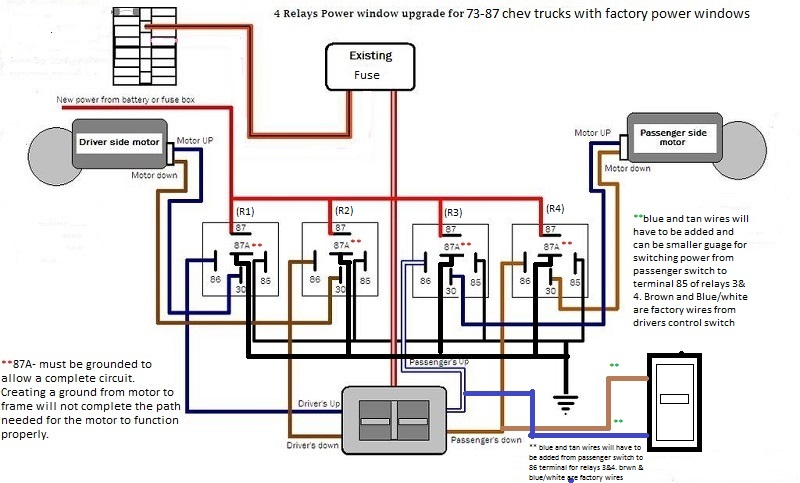

# Power Windows

Like the headlights, one of the many things that plagued the square body truck series with power windows is very slow lowering and raising of the windows. This was because the power to run the power windows had to run directly through the power windows switches. Because of this there is a limitation on the number of amps you can pull through a switch and makes the wiring path much longer to travel. Modern vehicles fix this problem by using multiple relays to handle the high amps needed to run the window motors and the only amperage needed to switch the relays are passed through the actual switch.

