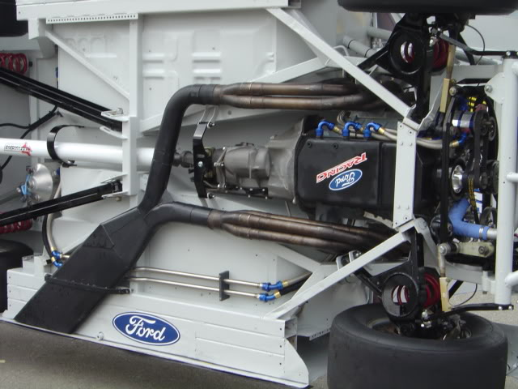

# Exhaust

Short headers > Y-Pipe > High Flow Catalytic Converter > Muffler > Boom Tube

Headers:

Y-Pipe: Flowmaster Y250300

Catalytic Converter: Thunderbolt 3" Catalytic Converter (4" Round x 11" Long)

Muffler: Flowmaster DBX

Tip:

[Summit Racing Volcano Wrap](https://www.summitracing.com/parts/sum-350212-1)

## Exhaust Pipe Sizes for Street Performance

| Single OD (IN) | Dual OD (IN) | Power (HP) | Engine Size (CI) |
| :--: | :--: |  :--: |  :--: |
| 2.0 | 2.0 | 100 | 150-200 |
| 2.25 | 2.0 | 150 | 150-200 |
| 2.5 | 2.0 | 200 | 150-200 |
| 2.25 | 2.0 | 150 | 200-250 |
| 2.5  | 2.0 | 200 | 200-250 |
| 2.5 | 2.25 | 250 | 200-250 |
| 2.5 | 2.0 | 200 | 250-300 |
| 2.5 | 2.25 | 250 | 250-300 |
| 3.0 | 2.5 | 300 | 250-300 |
| 3.0 | 2.5 | 250 | 300-350 |
| 3.0 | 2.5 | 300 | 300-350 |
| 3.5 | 2.5 | 350 | 300-350 |
| 3.0 | 2.5 | 300 | 350-400 |
| 3.5 | 2.5 | 350 | 350-400 |
| 4.0 | 3.0 | 400 | 350-400 |
| 3.5 | 2.5 | 350 | 400-450 |
| 4.0 | 3.0 | 400 | 400-450 |
| 4.0 | 3.0 | 450 | 400-450 |
| 4.5 | 3.5 | 400 | 450-500 |
| 4.5 | 3.5 | 450 | 450-500 |
| 4.5 | 3.5 | 500+ | 450-500 |
