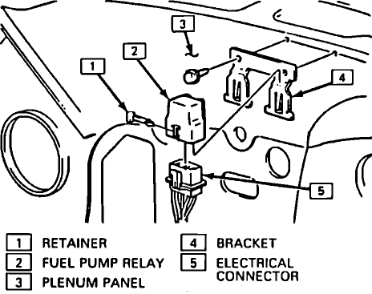

# Diagrams

## Links

[http://forum.73-87chevytrucks.com/smforum/index.php?topic=36844.0](http://forum.73-87chevytrucks.com/smforum/index.php?topic=36844.0;topicseen)

[http://forum.73-87chevytrucks.com/smforum/index.php?topic=9072.0](http://forum.73-87chevytrucks.com/smforum/index.php?topic=9072.0)
